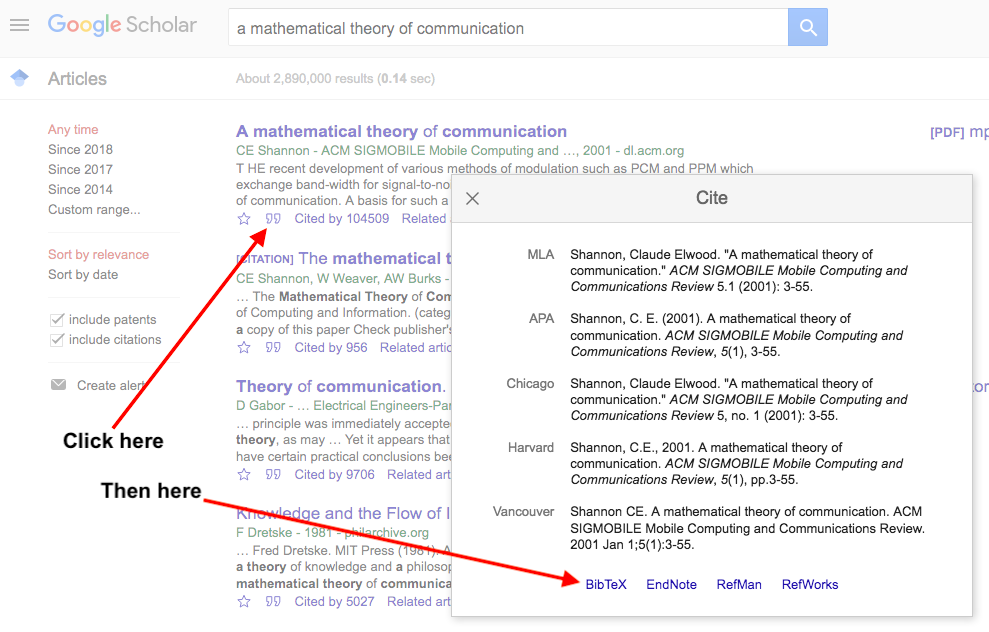
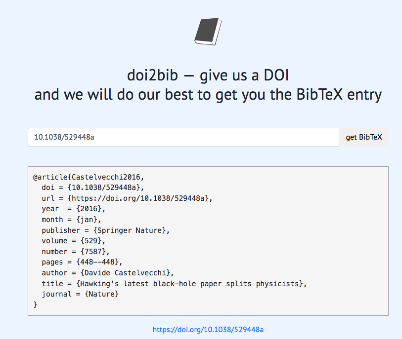

# How to update the bestiary

### Inclusion rules:  
The criteria for inclusion are quite simple: 

1. The work must be in a peer reviewed publication (journal or conference);  
2. The title or abstract must name the algorithm after the natural (or supernatural) metaphor on which it was based;  

It is also important to highlight that only the earliest known mention for each metaphor is to be included.

### How to include a new entry:  
If a new paper meets the criteria above (please double check to avoid duplicated metaphors - if we have two of a kind they may start breeding), it can be included in the bestiary using its bibtex entry:

- If the paper does not have a DOI, please find it using [http://scholar.google.com/](http://scholar.google.com/), and export the citation using Google Scholar's bibtex export tool:

- If the paper has a DOI, please use [https://www.doi2bib.org/](https://www.doi2bib.org/) to generate a standardized Bibtex entry  

Replace the standard bibtex key by the metaphor name, using periods (".") in place of spaces, then add the entry to the end of the appropriate .bib file in the _Cages_ folder.

Once the new entry is added, just `source` the file `1_README_generator.R` to generate the new README.md file, and send a PR to the EC-Bestiary repository on github. Please check if no warnings or errors occurred - sometimes (rarely) **doi2bib** or **Google Scholar** forget to export the _year_ folder, causing the script to ignore those entries. If that happens, please fix the offending entry manually and re-run `1_README_generator.R`.